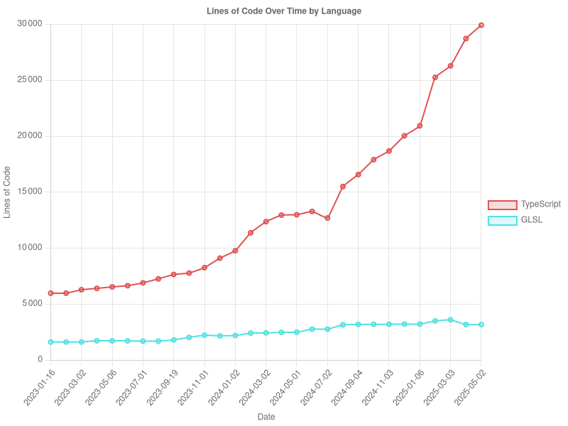

# cloc-graph

A TypeScript tool for tracking lines of code over time by language with visualization.



[](https://github.com/yourusername/cloc-graph/actions)
[](https://codecov.io/gh/yourusername/cloc-graph)

## Prerequisites

- Node.js (v16 or higher)
- Git
- [cloc](https://github.com/AlDanial/cloc) (Count Lines of Code) installed and available in your PATH

## Installation

### Global Installation

```bash
npm install -g cloc-graph
```

### Local Installation

```bash
npm install cloc-graph
```

## Usage

```
cloc-graph [options]
```

### Options

- `-p, --path <path>`: Path to the Git repository (default: current directory)
- `-s, --step <number>`: Sample every Nth commit (default: 1)
- `-g, --granularity <type>`: Granularity: commits | daily | weekly | monthly (default: commits)
- `-t, --top <number>`: Limit to top N languages by total lines (default: all languages)
- `-e, --exclude <languages>`: Comma-separated list of languages to exclude (e.g., "HTML,CSS")
- `-i, --include <languages>`: Comma-separated list of languages to include (e.g., "JavaScript,TypeScript")
- `-f, --from <date>`: Start date for time range in YYYY-MM-DD format
- `-u, --to <date>`: End date for time range in YYYY-MM-DD format
- `-m, --max-samples <number>`: Maximum number of commits to analyze (default: 100)
- `--smart-sampling`: Use smart sampling algorithm for large repositories

### Examples

```bash
# Generate graph for current repository
cloc-graph

# Generate graph for a specific repo with weekly granularity
cloc-graph -p /path/to/repo -g weekly

# Generate graph showing only the top 5 languages
cloc-graph -t 5

# Sample every 10th commit to process large repositories faster
cloc-graph -s 10

# Generate graph excluding certain languages
cloc-graph -e HTML,CSS

# Generate graph including only specific languages
cloc-graph -i JavaScript,TypeScript

# Generate graph for a specific time range
cloc-graph -f 2023-01-01 -u 2023-12-31

# Process large repositories more efficiently
cloc-graph --smart-sampling -m 200
```

## Outputs

The tool generates two files:

1. `loc_over_time_by_lang.csv`: CSV file containing the lines of code for each language at each point in time
2. `loc_chart.png`: A line chart visualization showing the trends of lines of code over time by language

## Development

### Setup

```bash
git clone https://github.com/yourusername/cloc-graph.git
cd cloc-graph
npm install
```

### Build

```bash
npm run build
```

### Run in development mode

```bash
npm run dev
```

### Running Tests

```bash
# Run all tests
npm test

# Run tests in watch mode during development
npm run test:watch

# Generate test coverage report
npm run test:coverage
```

### Code Style

This project uses Prettier for code formatting. You can format your code with:

```bash
npm run format
```

### Project Structure

```
src/
├── cli/            # Command-line interface handling
├── services/       # Core services
│   ├── chartService.ts       # Chart generation
│   ├── clocService.ts        # Code analysis
│   └── gitService.ts         # Git repository interaction
├── types/          # TypeScript type definitions
├── utils/          # Utility functions
│   ├── dateUtils.ts          # Date manipulation utilities
│   └── sampling.ts           # Sampling algorithms
└── __tests__/      # Test files
```

## Contributing

Contributions are welcome! Please feel free to submit a Pull Request.

1. Fork the repository
2. Create your feature branch (`git checkout -b feature/amazing-feature`)
3. Run tests to ensure everything works (`npm test`)
4. Commit your changes (`git commit -m 'Add some amazing feature'`)
5. Push to the branch (`git push origin feature/amazing-feature`)
6. Open a Pull Request

Please make sure your code passes all tests and follows the project's coding style.

## License

MIT © Barthélemy Paléologue

See the [LICENSE](LICENSE) file for details.